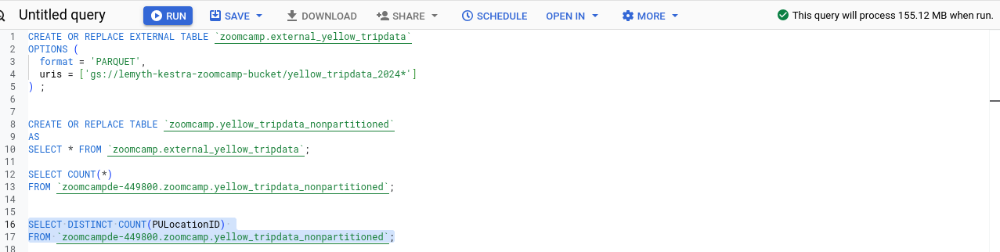
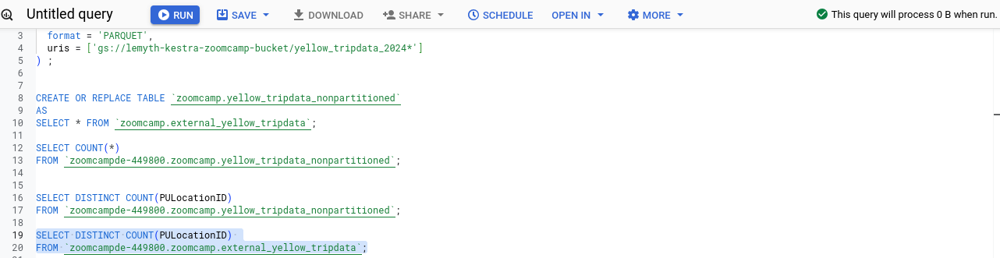

# Module 3 Homework: Data Warehouse : Big Query
We will start this homework by setting up an external table from our data in our GCP Bucket and then create a materialized table using the external table
## BIG QUERY SETUP:
Create an external table using the Yellow Taxi Trip Records.
``` SQL 
CREATE OR REPLACE EXTERNAL TABLE `zoomcamp.external_yellow_tripdata`
OPTIONS (
  format = 'PARQUET',
  uris = ['gs://lemyth-kestra-zoomcamp-bucket/yellow_tripdata_2024*']
) ;
```

Create a (regular/materialized) table in BQ using the Yellow Taxi Trip Records (do not partition or cluster this table). 

``` SQL 
CREATE OR REPLACE TABLE `zoomcamp.yellow_tripdata_nonpartitioned`
AS 
SELECT * FROM `zoomcamp.external_yellow_tripdata`;
```

## Question 1
Question 1: What is count of records for the 2024 Yellow Taxi Data?
``` SQL 
SELECT COUNT(*) 
FROM `zoomcampde-449800.zoomcamp.yellow_tripdata_nonpartitioned`;

```

## Question 2
Write a query to count the distinct number of PULocationIDs for the entire dataset on both the tables.
What is the estimated amount of data that will be read when this query is executed on the External Table and the Table?
When the query is executed on the mæterialized table, we do have:



When the query is run on the external table : 



So the correct answer here is `0 MB for the External Table and 155.12 MB for the Materialized Table`

## Question 3
Write a query to retrieve the PULocationID from the table (not the external table) in BigQuery. Now write a query to retrieve the PULocationID and DOLocationID on the same table. Why are the estimated number of Bytes different?

``` SQL
 --Query to retrieve the PULocationID from the materialized table
SELECT PULocationID
FROM `zoomcampde-449800.zoomcamp.yellow_tripdata_nonpartitioned`;
```
 The estimated bytes is 


``` SQL
 --Query to retrieve the PULocationID and DOLocationID from the materialized table
SELECT PULocationID, DOLocationID
FROM `zoomcampde-449800.zoomcamp.yellow_tripdata_nonpartitioned`;
```
 The estimated bytes is 


## Question 4
How many records have a fare_amount of 0?

``` SQL 
SELECT COUNT(1)
FROM `zoomcampde-449800.zoomcamp.yellow_tripdata_nonpartitioned`
WHERE fare_amount = 0;
```
Answer is `8,333`

## Question 5
What is the best strategy to make an optimized table in Big Query if your query will always filter based on tpep_dropoff_datetime and order the results by VendorID (Create a new table with this strategy)

The best strategy is to partition by tpep_dropoff_datetime and Cluster on VendorID. This strategy is related to the level of granularity of tpep_dropoff_datetime (which is large grain) and VendorID (fine grain) . We will note also that partitioning is generally corellated with TIME unit columns.


## Question 6
Write a query to retrieve the distinct VendorIDs between tpep_dropoff_datetime 2024-03-01 and 2024-03-15 (inclusive)

Use the materialized table you created earlier in your from clause and note the estimated bytes. Now change the table in the from clause to the partitioned table you created for question 5 and note the estimated bytes processed. What are these values? 
- Query on the non partitioned table
``` SQL
SELECT DISTINCT(VendorID)
FROM `zoomcamp.yellow_tripdata_nonpartitioned`
WHERE DATE(tpep_dropoff_datetime) BETWEEN "2024-03-01" AND  "2024-03-15";
```
The estimated bytes is 

- Query on the partitioned table
``` SQL
SELECT DISTINCT(VendorID)
FROM `zoomcamp.yellow_tripdata_partitioned`
WHERE DATE(tpep_dropoff_datetime) BETWEEN "2024-03-01" AND  "2024-03-15";
```
The estimated bytes is 


## Question 7
Where is the data stored in the External Table you created?

- The external table's data are stored in GCP bucket

